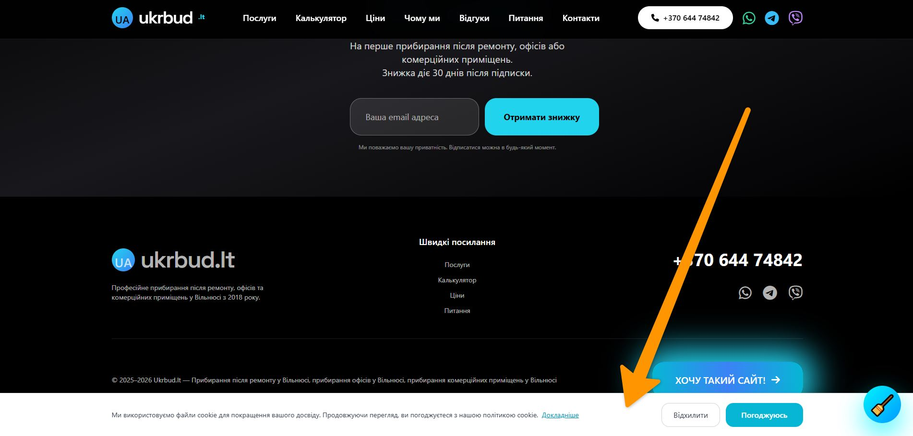

## GDPR Consent Banner

This project features a modern, GDPR-compliant cookie consent banner that automatically adapts to the visitor's language.

### ✨ Features
- Automatic language detection based on the current page (`index.php`, `ru.php`, `ua.php`, `en.php`)
- Clear **Accept** and **Reject** buttons
- If the user rejects cookies, a non-blocking amber warning message appears at the top
- Option to **accept cookies again** directly from the warning banner
- User preference is saved in `localStorage`
- Fully responsive and accessible design
- Clean, modern UI that matches the website style

### 🌍 Supported Languages
- **Lithuanian (LT)** — Lietuvių
- **Russian (RU)** — Русский
- **Ukrainian (UK)** — Українська
- **English (EN)** — English
- **Norwegian (NO)** — Norsk

### 📁 Files
- `gdpr-consent.php` — main consent banner component
- Integrated into all language versions of the site (`index.php`, `ru.php`, `ua.php`, `en.php`)

### How it works:
When a user visits the site for the first time, a consent banner appears at the bottom of the screen.

- Clicking **"Accept"** hides the banner and saves the preference.
- Clicking **"Reject"** hides the banner and shows a warning message at the top of the page, informing the user that some features may not work correctly.
- The user can click **"Accept cookies again"** in the warning message to change their decision at any time.

The banner fully respects user privacy and follows GDPR best practices.

---

## GDPR-samtykkebanner (Norsk)

Dette prosjektet inkluderer et moderne GDPR-kompatibelt samtykkebanner for informasjonskapsler som automatisk tilpasser seg brukerens språk.

### Funksjoner:
- Automatisk språkdeteksjon basert på gjeldende side
- Klare knapper: **Godta** og **Avslå**
- Ved avslag vises et ikke-blokkerende varsel øverst på siden
- Mulighet til å **godta informasjonskapsler igjen** når som helst
- Valget lagres i `localStorage`

### Støttede språk:
- Litauisk (LT)
- Russisk (RU)
- Ukrainsk (UK)
- Engelsk (EN)
- Norsk (NO)

---

## GDPR Банер згоди (Українська)

Проект використовує сучасний GDPR-сумісний банер згоди на використання файлів cookie, який автоматично адаптується під мову користувача.

### Можливості:
- Автоматичне визначення мови сторінки
- Кнопки: **Погоджуюсь** та **Відхилити**
- При відмові показується попередження зверху сторінки
- Можливість **прийняти cookie знову** в будь-який момент
- Вибір зберігається в `localStorage`

### Підтримувані мови:
- Литовська (LT)
- Російська (RU)
- Українська (UK)
- Англійська (EN)
- Норвезька (NO)

---

## GDPR Баннер согласия (Русский)

Проект использует современный GDPR-совместимый баннер согласия на использование файлов cookie, который автоматически адаптируется под язык пользователя.

### Возможности:
- Автоматическое определение языка страницы
- Кнопки: **Согласен** и **Отклонить**
- При отказе показывается предупреждение сверху страницы
- Возможность **принять cookie снова** в любой момент
- Выбор сохраняется в `localStorage`

### Поддерживаемые языки:
- Литовский (LT)
- Русский (RU)
- Украинский (UK)
- Английский (EN)
- Норвежский (NO)
